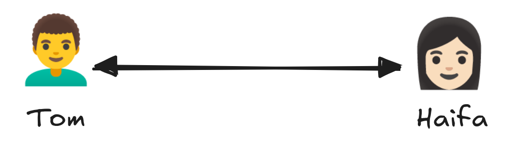
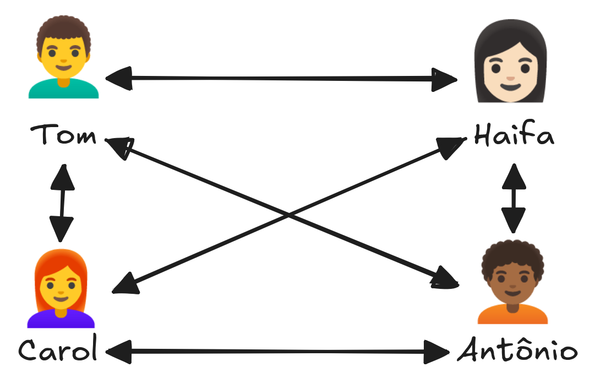
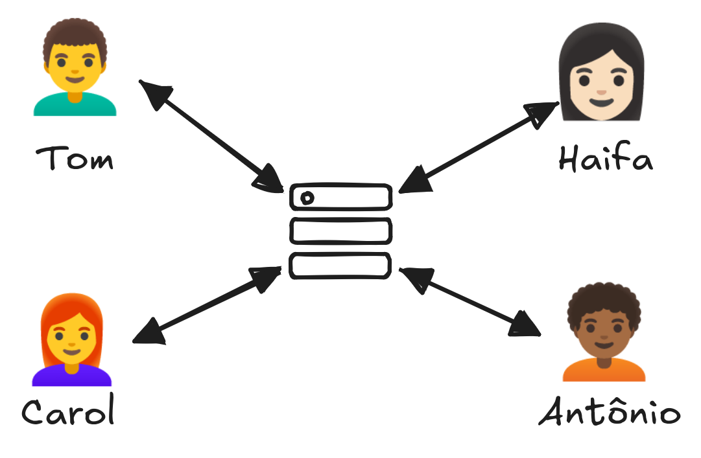
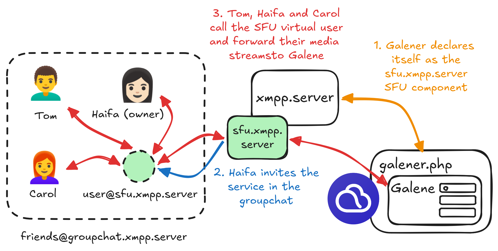

Movim Galener Deployment
========================

This tutorial describes the different steps needed to set up the Galener XMPP service.

# General information

## Video call structures

Audio and video calls on XMPP are organized into different network topologies.
Media sessions are negotiated using a set of XMPP extensions called Jingle.

### One-to-one calls

When two people call each other, they negotiate direct peer-to-peer audio and video streams through the XMPP network.

This means that once the call is fully negotiated, the audio and video data are sent directly between the two people without passing through the XMPP network anymore (XMPP is only used to set up the call).



### One-to-many calls

When several people want to call each other, there are two possible topologies.

#### I. Mesh calls

These calls are negotiated using the XMPP extension [XEP-0272: Multiparty Jingle (Muji)](https://xmpp.org/extensions/xep-0272.html).

All participants who want to call each other join an [XMPP group chat](https://docs.modernxmpp.org/client/groupchat/) and share some basic information indicating how they can be reached.

Each participant then initiates one-to-one calls with all the others, the same way a call to a single person is set up.

With N peers, this results in N×(N-1)/2 connections, and each device has to encode and upload its stream separately to every peer, this scales poorly beyond 3-4 people.



#### II. SFU calls

Each participant initiates a call with a central SFU (Selective Forwarding Unit), which then forwards (routes, without decoding or re-encoding) the appropriate streams to everyone else. The upload cost per peer stays constant no matter how many participants join.



## Movim architecture

Movim supports all three modes described above. The one-to-one and mesh modes don't require any specific server beyond the default XMPP network used for the initial negotiation.

Since version 0.35, Movim provides a dedicated XMPP service that can be plugged into any XMPP server using the widely deployed [XEP-0114: Jabber Component Protocol](https://xmpp.org/extensions/xep-0114.html). This service acts as an independent SFU.

This SFU component, called Galener, wraps the [Galene video-conferencing server](https://galene.org/) and provides an XMPP Jingle interface to it.

### How does it work?

Once fully set up, when the Movim daemon is launched, the `galener.php` Movim worker connects to a configured XMPP server and announces itself on the XMPP network as an SFU service for that server.

Owners of group chats hosted on that XMPP server will then see a dedicated button asking whether they want to invite the new SFU service into their room. If they accept, the service joins the room, and the group chat participants are then able to call it.



When a group chat participant wants to join the call, they call the SFU's virtual user in their room. This user then negotiates an XMPP Jingle session with them and instructs them to forward their media streams (audio and video) to the Galene SFU.

# Setting it up

## Create an XMPP service

First, you need to create a new XMPP component on your XMPP server.

* [ejabberd documentation](https://docs.ejabberd.im/admin/configuration/listen/#ejabberd_service)
* [Prosody documentation](https://prosody.im/doc/components)

For ejabberd, here is an example of the SFU component declaration in `ejabberd.yml`:

```
  -
    port: 5353
    module: ejabberd_service
    access: all
    ip: "::"
    hosts:
      "sfu.xmpp.server":
        password: "<galener_password>"
```

Then reload your XMPP server.

## Set up Galene for Movim

Set up Galene alongside Movim; see the related [Galene installation guide](https://galene.org/galene-install.html) to configure it properly. If you already have Galene set up elsewhere, we strongly recommend using a dedicated setup for Movim instead.

The Galene directory doesn't need the same permissions as Movim, but the `galene` binary must be executable by the Movim user (`www-data`, `apache`, etc.).

Movim will then configure Galene to save its configuration in its own `cache/` directory.

## Connect Galene to Movim

If Movim is already set up (see [INSTALL.md](../INSTALL.md)), you can now declare (or copy) the `GALENER_*` variables in your `.env` file (from `.env.example`, if they aren't already there).

Configure the XMPP service and the complete path to the `galene` binary:

```
# Galener configuration
GALENER_XMPP_HOST=sfu.xmpp.server
GALENER_XMPP_PORT=5353
GALENER_XMPP_PASSWORD=<galener_password>
GALENER_GALENE_PATH=</path/to/the/galene/directory>/galene
```

## Launch Galener and invite the component

If everything is set up properly, you should see the following line when restarting the Movim daemon:

```
📞 Galener Worker launched
```

If not, Movim will report the errors; as always, you can also find PHP-related errors in `log/errors.log`.

The XMPP service will then start being announced on the XMPP network.

As a group chat owner, you'll see the following button in your room's configuration panel, or when opening a conference room in your Space.


You'll then see the service join your room (in our example, `sfu.xmpp.server`) as an administrator and invite a dedicated virtual user into the group chat.

Movim will automatically detect that this dedicated user can be called, and all participants will be able to initiate a Wide Conference Call.